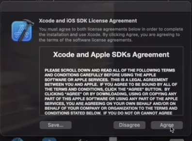
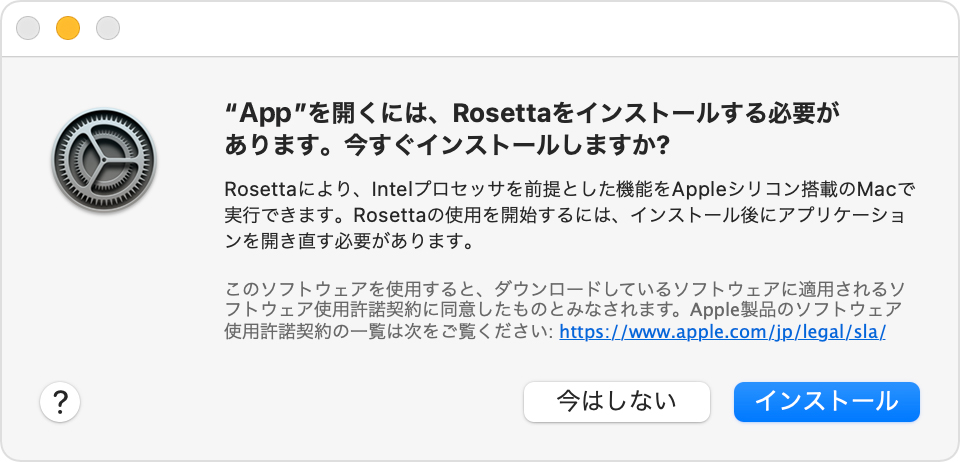

# M1 Macでの iOSアプリの開発環境構築 解説
## これはYouTube動画の資料です
M1 Macで iPhone(iOS)アプリ開発 環境構築【初学者向け解説】

https://youtu.be/wB0OQO_NF2Y


---

## はじめに
- なるべく、プログラミング初学者向けにもわかりやすく解説していきます
- 2021年1月時点の情報です
  - M2のMacが出る頃(いつ?)には 古い情報になってるはずなのでお気をつけください
  - (でもiOSアプリ開発に関しては さほど変わらないかも🤔)
##
##
##
##
##

---

## 自己紹介：オサミー
- ソフトウェアエンジニア。株式会社プレジニア代表取締役。
- iPhoneアプリ開発歴10年。企画開発したiPhoneアプリ160万ダウンロード以上。
- 最近はフロントエンド(React, TypeScript)やってる

※M1 Macは2020年12月購入した.
※Xcodeのインストールも2020年12月にした.
※今回は「Xcodeのインストール」は解説のみ.
HelloWorldアプリいっしょにつくっていこう😊
##
##
##
##
##

---

## 動画(iOSアプリ開発環境 構築)の目次
1. この動画作成の背景
2. 理論編
 2-1. Intel MacとM1 Macの違い 
 2-2. Rosseta上なのかARMアーキテクチャ上なのか意識しよう！
3. 実践編: 
 3-1. Xcodeインストール
 3-2. Rosettaインストール
 3-3. Hello worldアプリ開発←ここからいっしょにやっていきましょ💪
 3-4. CocoaPodsインストール
 3-5. CocoaPods使ってライブラリをいれてみよう
 3-6. 優れたライブラリ集紹介
##
##
##


---

## 1. この動画作成の背景: オサミーの想い
- 🤔ちまたに日本語 情報溢れてるし 「わざわざ俺が出さなくてもいいか」と思ってた...
  - 🤔QiitaもZennもあるし
- 🤔Python, Ruby, Javaは自分も慣れてないし 開発環境構築 動画つくったけど..
- 🤔iOSアプリの環境構築は Xcode落とすだけっしょ...
## だが しかし...
##
##
---

### オサミーがこの動画出すことに意味がある！
- プログラミングに興味ある人が, アプリ開発のスタートダッシュ切れるために...
  - 頑張る！💪💪💪価値を提供していきたい..!😎😎😎
- Python, Ruby, Javaと環境構築動画やってきて なぜiOSアプリはやらない?
  - やるぜ！💪💪💪
### 😎「ソフトウェアエンジニアを目指す人」すべての人に貢献したい...!
##
##
##
##
##
---

## 2. 理論編 目次
2-1. 「M1 Mac」と 「Intel Mac」の違い
2-2. Rosseta上なのかARMアーキテクチャ上なのか意識しよう！
##
##
##
##
##
##
##
##
##

---

## 2-1.「M1 Mac」と 「Intel Mac」の違い
- 「M1 Mac」の環境は 「Intel Mac」の開発環境と大きく違うことに注意しよう！
  - これは、「M1 Macでプログラミングする上で注意すべき」ポイント①

### ただし、「iOSアプリ開発」に限ってはあまり意識しなくてよいかも
##
##
##
##
##
##

---

### 「M1 Mac」と 「Intel Mac」の違い
### ①Intel Macとは
- Intelのチップ(CPU, GPUなど)が搭載されたMac
  - 古い(〜2020年)
- 2020年までのPC(MacBook Airなど)ではIntel社のCPUを使用
  - Apple「Intelやーめた. これからチップは自社設計するわ」
  - Intel「😨」
  - ARM「😚」
  ※ ARM社とは：Apple社へチップの回路図を提供してる会社
- 「M1 Mac」よりコスパ悪い = 価格が高くてスピード遅い
##
##
##


---

### ②M1 Macとは
- Apple社が設計した M1チップ(後述) が搭載されたMac
  - ARM社がApple社へチップの回路図を提供してる
  - そのベースアーキテクチャ(設計)を「ARMアーキテクチャ」と呼ぶ
  - ARMアーキテクチャのApple設計チップを総称して「Apple Silicon」呼ぶ
  - 搭載モデルは "MacBook Air", "MacBook Pro", "Mac mini"の3種類
- M1 Mac は 2020年11月に発売！（新しい）
- 性能がいい意味でヤバい = 速くて 省電力. 
  😎コスパ最高!
  😎これからもっともっとApple Silicon Macが売れていくはず
##
##
##
##


---

#### M1チップとは
- [ARMアーキテクチャ](https://ja.wikipedia.org/wiki/ARM%E3%82%A2%E3%83%BC%E3%82%AD%E3%83%86%E3%82%AF%E3%83%81%E3%83%A3)として第一弾のチップが「M1チップ」.
- 正確には[「Apple M1」](https://ja.wikipedia.org/wiki/Apple_M1)
- 😎これから M2, M3, M4...と数字があがっていくと予想してる
  - 前例) iPhoneのチップ→[「Apple A12」](https://ja.wikipedia.org/wiki/Apple_A12)[「Apple A13」](https://ja.wikipedia.org/wiki/Apple_A13)[「Apple A14」](https://ja.wikipedia.org/wiki/Apple_A14)
- [TSMC](https://ja.wikipedia.org/wiki/TSMC)社製
- 詳細は YouTube動画 [ARMプロセッサがヤバい](https://youtu.be/esEGhckFyBU) 参照
  

##
##


---

## 2-2. Rosseta上なのかARMアーキテクチャ上なのか意識しよう！
- これは、「M1 Macでプログラミングする上で注意すべき」ポイント②
##
##
##
##
##
##
##
##
##
---

###### Rosseta上なのかARMアーキテクチャ上なのか意識しよう！
## いま動かそうとしてるプログラムは、「Rosseta上なのか」「ARMアーキテクチャ上なのか」意識すべし！
- Rosetta上では動くが、ARMネイティブで動かないプログラムがある
- 今回の「iOSアプリ開発」では 後述のCocoaPods (Rubyのソフトウェア)がそれ
##
##
##
##
##
##
##

---

###### Rosseta上なのかARMアーキテクチャ上なのか意識しよう！

- M1 Macの特徴：Rosetta を使ってIntel Mac用のソフトウェアを使うことができる(例外あり)

### Rosetta とは
- 従来のインテル用のMacアプリを Apple Silicon Mac上で自動的に変換して実行できるようにする仕組み
- 「Rosettaを使用してひらく」チェックボックスつけてアプリ起動すると、Rosetta上で動く
    - 例) ターミナル, Xcode, iTerm2 など
- アクティビティモニタ使えば
  - どっちのアーキテクチャで アプリが動いてるかわかるよ

##
##

---


---


---
### いま「Rosseta上なのか」「ARMアーキテクチャ上なのか」確認コマンド

- 確認コマンド:ターミナルで `uname -m` 打つ
  - `arm64`と出力 : ARMアーキテクチャ で実行中
  - `x86_64`と出力 : Rosetta利用 または ネイティブIntelアーキテクチャ で実行中
- オサミーの場合：
  - ARMアーキテクチャで実行したい場合「ターミナル.app」で実行
  - Rosettaで実行したい場合「iTerm2.app」で実行
  - VSCode上では適宜 `$ arch -x86_64 zsh` や `$ arch -arm64 zsh` で切り替えする
### 😎iOSアプリ開発ではあんまり使わない(=アーキテクチャ意識する頻度は少ない)けど...
#### 😎覚えておいて損はない
##


---  
###### Rosseta上なのかARMアーキテクチャ上なのか意識しよう！
### 参考:
### Rosetta使えば動くのか ARMネイティブ対応(M1最適化されてる)なのか ソフトウェア一覧まとめサイト
  - Is Apple silicon ready?
  - https://isapplesiliconready.com/

##
##
##
##
##


---

## 3. 実践編 目次: Xcodeインストール〜HelloWorldアプリ開発
## やること
3-1. Xcodeインストール
3-2. Rosettaインストール
3-3. Hello worldアプリ開発←ここからいっしょにやっていきましょ💪
3-4. CocoaPodsインストール
3-5. CocoaPods使ってライブラリをいれてみよう
##
##
##
##

---

## 3-1.Xcode インストール
### Xcodeとは
- iOSアプリやMacアプリを開発するための統合開発環境(IDE).
  - エディタだけでなくシミュレーターやデバッグツールなども含まれてるよ
- 10〜30 GBくらいあるので たくさんMacの容量食うよ
- 2021/4時点の最新バージョン: `12.4`
###
###
###
###
###
###

---


### 俺のXcodeは 29.65GB もあるYO!
- 初期インストール時は 12GBくらいな気がする🤔


---

### インストールしてみよう
- Mac App Storeで「Xcode」と検索してインストール


---

#### Xcodeインストール時の注意点2つ
- ①「速くて」「データ使い放題」のインターネット回線で！
  - データとして「12GB + α 」ダウンロードする
  - 回線が遅いと, ダウンロードに1時間以上かかるぞ
  - データ容量気にしちゃうと ストレスだよね
- ②Rosettaインストールの確認メッセージはクリック効かないので注意！(後述)
  - Apple側のバグ
##
##
##
##
##

---

### Xcodeインストール中
※回線によるが10分〜1時間ほどかかる
- 散歩でもしてきましょう
- (もしくは)
- Macのトラックパッドの使い方でもどうですか
  - 「Launchpad(アプリケーションアイコン一覧)表示する方法」シェアします
    **→Xcodeダウンロードの進捗具合がわかる** のでぜひ
##
##
##
##
##

---
## Launchpad


##
##
##


---

### Launchpad表示させて Xcodeのダウンロード進捗を見よう
#### Launchpadとは
- Macにおける アプリケーションアイコン一覧 の画面

#### Launchpad表示方法
- 小指以外の4本指で 
  - トラックパッドに, (手をひらいて)4本指 触れた状態から
  - シュッと しぼませる.( じゃんけんの「パー」から「グー」にする )
- システム環境設定 > トラックパッド > その他ジェスチャ > Launchpad
- Apple公式YouTube 
  - [How to use Multi-Touch gestures on your Mac — Apple Support](https://youtu.be/Q7vK0uhqLy0?t=91)
###
###
###

---

### たまにXcodeインストールに失敗する...😫
- おそらくネット回線の問題
- あきらめずに何度もトライだ！ 
- **速くて安定した(途切れることのない)インターネット回線で！**
##
##
##
##
##
##
##
##

---

### Xcodeインストール後 起動してみよう
- Finder > アプリケーション > Xcode.app ダブルクリック　
  - もちろんLaunchpadからでもOK
  - (余談)Finderでは「拡張子表示」をONにしよう

#### 補足: これから説明するスクリーンショットの一部は「ダークモード」なので黒っぽいです
- システム環境設定 > 一般 > 外観モード >　ダーク
##
##
##
##
##


---

### Xode起動したら色々きかれるはずなので
#### →全部 "Agree", "Install"など「肯定」のほうを選ぼう


[Thank you, Basuke-san!](https://www.youtube.com/watch?v=y-yq-wVV93c&t=2719s)


---

### 必要なコンポーネントインストール中

##
##
##
##
##


---

### Rosettaをインストールするか聞いてくるはず
### ※ここがAppleの不具合だ！ 先程伝えた「注意点②」 (2021年1月時点)

- 結論：**クリックが効かないので、 Enterキーを押せ ！**　
- どれだけの人がハマったか🤔
  - 少なくとも世界中で5000人はここでつまづいてる🤔

##


---

日本語だとこっちだったかも


- とにかくマウス(orトラックパッド)のクリックが効かない！(2021年1月時点)
  - **Enter(Return)キーを押せ！**
  = キーボードの一番右にあって, 一番デカい キー「⮐」
##
##


---

### コンポーネントをインストールするか聞いてくるはず
開発に必要なので, インストール必須だよ
###  `Install` 選んでおこう

##
##
##
##


---

### すべて終わったら起動するはず!　
起動後、この画面が表示できたら Xcodeまわりすべてインストール成功

###
##


---

## 3-2. Rosettaインストール
→すでに完了している😚
##
##
##
##
##
##
##
##
##


---

- ちなみに、Xcodeには "Command Line Tools"も含まれる
### (余談)Command Line Toolsとは
- macOSのターミナルで、コマンド使うために必要なツール
- Apple LLVM complier, Linker, Makeなどが内包されている
  - 😎アプリ開発に必要なもんってことよ
- gitを利用するのにも必要
#### XcodeなしでCoomand Line Toolsをインストールする方法
  - ターミナルでコマンド `xcode-select --install` 実行

##
##
##
##

---

## 3-3. Hello Worldアプリ開発やってく！
##
##
##
##
##
##
##
##
##
##

---

###### Hello Worldアプリ開発
### 「Welcome to Xcode」と表示されてる画面で
  - "Create a new Xcode project"を選択する
##
##
##
##
##
####

---
###### Hello Worldアプリ開発
### 「Choose a template for your new project」画面で
- platformは「iOS」選ぶ
  - 「App」を選ぶ
  - 右下のNext押す
- Product Nameは「HelloWorld」
  - 🙅‍♂️スペースはいれないこと
  - 大文字で言葉区切る(キャメルケース/パスカルケース)がベター
    - 👍 `HelloWorld` ←「キャメルケース」(正確にはパスカルケース）と呼ぶ
      ※正確には「キャメルケース」は `helloWorld`. 
      ※iOS/Swiftの世界ではメソッドやプロパティはキャメルケースで書くことが推奨されています
    - 👎 `hello-world` ←「ケバブケース」
    - 👎 `hello_world` ←「スネークケース」
  - その他の項目は初期値設定でOK! 何も変更せずでOK!
  - Nextを押す

---

### フォルダ選択画面で
- 好きな場所を選ぼう. どこでもOK
  - オサミーの場合は `/Users/osuzuki/ios_app/` の下
  - ホームディレクトリ(`/Users/{ユーザー名}/`) の下に `ios_app` フォルダつくっておくとオサミーと同じにできるよ（あとでやりやすいかも）
- Create Git repository on Macはチェック入れておいてOK
  - GitについてはYouTube動画[【Git入門】現役エンジニアがGitの使い方を解説しました（理論編〜Sourcetree実践編〜VSCode上コマンドライン実践編）](https://youtu.be/-KifXdoC6DI) 参照
- Create を押す
##
##
##
##
##

---

### プロジェクト開いたら
### シミュレーターで実行してみよう
- 左上の HelloWorld > [My Mac] の 「My Mac」 のところを選択してシミュレーターを選ぼう
  - アプリの実行先を選択する
  - 今回は「iPhone 12 Pro」選ぶ
- Run(実行)ボタン「▷」押して アプリを起動させる
- シミュレーターが起動して アプリが起動するはず

#### おめでとう！最初のアプリだ！ ✋💥(パーン)
##
##
##

---

## 実行できない場合(エラーになる場合)は
- 正しくシミュレーターを選択できてるか 確認しよう
  - 「iPhone 12 Pro」選んでみよう
- 署名が「Automatically manage signing」にチェック入ってるか確認してみよう
  - 左上の青いプロジェクト選択
  - TARGETSにある「HelloWorld」を選択
  - 「Signing & Capabilties」タブを選択
  - 2つ確認する
    - 「Automatically manage signing」にチェックが入ってる
    - Team が 自分のもの or 「NONE」が入ってる
##
##

---

## `Hello, world!` という文字を表示してみよう！ 1/2
- Main.storyboardをクリック
- 右上の「+」押して Label　を画面にドラッグアンドドロップ
  - 画面の真ん中らへんにに
- ラベルを選択して 右上の Inspector ボタンクリック
  - Inspectorが表示される
  - 右から3つめAtrributesタブに移動
  - Textの「Label」を「Hello, world!」に変更する
##
##
##
##
---

## `Hello, world!` という文字を表示してみよう！ 2/2
- ラベルを中央に寄せてみる(やらなくてもOK!)
  - Labelを選択したまま
  - 右下のAlignボタンをクリック
  - "Horizontally in Container"にチェック
  - "Vertically in Container"にチェック
  - "Add 2 Constraints"ボタンをクリック
  - 中央寄せになったらOK
- Runボタンクリックしてアプリ実行しよう

##
##
##


---

## できたかな？
- できた人〜!?
  - ハイタッチ! ✋💥(パーン)

### 自分なりにカスタマイズしてみよう
- ラベルの文言を変えたり
- ラベル色を変えたり
- ラベルのフォントを変えたり
- ラベルの制約(Contraint)を変えたり
- ...
##
##
##

---

## 3-4. CocoaPodsインストール

### CocoaPodsとは
- iOSアプリ用ライブラリのパッケージ管理ツール
- ライブラリ？
  - ある機能のまるっと実装したプログラムのかたまり
  - 「フレームワーク」とも言う
  - 例)ネットワークライブラリ[Alamofire](https://github.com/Alamofire/Alamofire)
  - 例)アプリ内課金ライブラリ[SwiftyStoreKit](https://github.com/bizz84/SwiftyStoreKit)
  - 例)ローディングライブラリ[PKHUD](https://github.com/pkluz/PKHUD)
- Ruby製
- M1 Mac 上では、Rosetta利用必須(2021年1月時点)
  - arm64向けのruby環境で実行しちゃダメよ🙅‍♂️
##

---

### CocoaPodsをインストールしてみよう
- Rosettaにチェックして ターミナルをひらく
  - ターミナルの場所：アプリケーション > ユーティリティ > ターミナル
  - Rosetta上でターミナルアプリをひらく
- ターミナルひらいたら 念の為 Rosetta上で動いてるか確認しよう
  - `unmae -m` 叩いて 「x86_64」 と返ってきたらOK
- 下記コマンドを叩いて, [CocoaPods](https://cocoapods.org/)をインストールしよう
  - `sudo gem install cocoapods`
- `which pod` でインストール成功したかどうか確認
  - `pod` コマンドの場所(パス)が正しく返ってきたら、インストール成功している
  - オサミーの場合→ `/usr/local/bin/pod`  　※ほとんどの人が同じはず
- `pod --version` でCocoaPodsのバージョン確認
  - オサミーの場合： `1.10.1`

---
 
### インストール失敗した場合
- Rosetta上で実行してるか確認しよう！
  - `uname -m` で 「x86_64」　が返ってくるか確認しよう！
  - 「arm64」と返ってきてたらNG🙅‍♂️ 
  - ターミナル.app とじて、Rosettaにチェックしてから再度起動しよう

##
##
##
##
##


---

## 3-5. CocoaPods使ってライブラリをいれてみよう
### Hello Worldアプリに ローディングライブラリ「PKHUD」をいれてみよう 1/4
- `cd` コマンドでカレントディレクトリ(いま あなたがいる場所)を移動させよう
  - オサミーの場合は `/Users/osuzuki/ios_app/HelloWorld` ここに移動したい
    - `cd ios_app`
    - `cd HelloWorld`
    - `pwd` 
      - 結果　`/Users/osuzuki/ios_app/HelloWorld`
  - 適宜、HelloWorldが存在しているディレクトリに移動してね
    - 例)デスクトップにHelloWorldプロジェクトあったら 
    `cd ~/Desktop/HelloWorld`
  - また、 `cd ..` で上の階層(ディレクトリ)に移動できるよ
- `pwd` でカレントディレクトリを確認する
  - オサミーの場合 `/Users/osuzuki/ios_app/HelloWorld`

---

### Hello Worldアプリに ローディングライブラリ「PKHUD」をいれてみよう 2/4
###### 以下　HelloWorldディレクトリで実行(`pwd`の結果が ほにゃらら/HelloWordが返ってくる)
- (terminal) `ls` で HelloWorld.xcodeprojが表示されるか確認しよう
  - `ls` は そのディレクトリに存在するファイルやフォルダを一覧表示するコマンド
  - `ls -la` で縦に並べて詳細表示できる
- (terminal)`pod init` 叩いてPodを初期化しよう
  - Podfile というファイルが作成される→確認してね
- Podfileをエディタでひらいて編集(エディタはなんでもよい. [VSCode](https://code.visualstudio.com/)がおすすめ)
  - `pod 'PKHUD', '~> 5.0'` と特定の箇所に記入する(Swiftのバージョンが4以上の場合)
  - 詳細は Githubの[PKHUD](https://github.com/pkluz/PKHUD)に書いてあるから見ておいてね. 
  - ライブラリの導入方法は、だいたい READMEに記載している
- (terminal) `pod install` 叩いて Podfile記載されたライブラリをインストールする
  - 「Pod installation complete!」と出たらインストール成功している

--- 

### Hello Worldアプリに ローディングライブラリ「PKHUD」をいれてみよう 3/4
###### `pod install` 成功したら... HelloWorld.xcworkspace が生成されている
- (terminal)`ls -la` 叩いて 
  - そのディレクトリに存在するファイルが表示されて 確認できる
  - さっき叩いたコマンド`pod install` によって 新しく生成されたのがこちら.. 
    - Podfile.lock, HelloWorld.xcworkkspace, Pods/
- (terminal)`open HelloWorld.xcworkspace` 叩いてプロジェクトひらこう
  - HelloWorld.xcworkspace をひらく (FinderからダブルクリックしてひらくでもOK)
  - もともとひらいていた「HelloWorld.xcodeproj」は閉じてね
  - 初学者あるあるミス！
    - →CocoaPods導入済みなのに「 .xcodeproj」ひらいてしまう😱
   - CocoaPods導入済みかどうかはPodfileの有無でわかるよ😎

---


### `pod install` に失敗する場合(1)
#### Podfileの記述ミスを疑って！
- 「正しい場所に」
  - Podfileの `target 'HelloWorld' do` と `end` の間に！
- 「正しいプログラム」を
  - 自分で打ち込まず、コピー&ペーストしよう！
  - 😩初学者あるある：タイピングミスして違う文字を入力してしまう..!
##
##
##
##
##

---

### `pod install` に失敗する場合(2)
#### エラーメッセージ
`
[!] CDN: trunk URL couldn't be downloaded: https://cdn.cocoapods.org/all_pods_versions_8_3_2.txt Response: URL using bad/illegal format or missing URL
`
#### 解決方法
- Apple Siliconに最適化されているrubyのせいかも
- Macデフォルトのsystemに戻して！(ruby 2.6)
- rbenvでいれてるんだったら.
  - `rbenv global system` と `rbenv rehash`
- 再度 `sudo gem install cocoapods`
- 再度 `pod install`
##


---
### `pod install` に失敗する場合(3)
#### 原因わからないので エラーメッセージ & 下記ソフトウェアのバージョン貼り付けてコメントくれーい
- Rubyのバージョンや環境
  - `ruby -v` の結果
- CocoaPodsのバージョン
  - `pod --version` の結果
- macOSのバージョン
  - 左上のリンゴマーク > このMacについて
- 実行マシン環境
  - `uname -m` の結果
##
##
##

---

### Hello Worldアプリに ローディングライブラリ「PKHUD」をいれてみよう 4/4
### ViewController.swiftに記述しよう

```
import PKHUD
```

```
override func viewDidAppear(_ animated: Bool) {
    super.viewDidAppear(animated)
    HUD.show(.progress)
    DispatchQueue.main.asyncAfter(deadline: .now() + 2) {
        HUD.flash(.success, delay: 1.0)
    }
}
```
### 実行だ！
### できた人〜！ ？　ハイタッチ! ✋💥(パーン)
##
##

---

## 他にもライブラリ入れてみてね
- ①Podfileに `pod ホニャララ` 記述して,
- ②ターミナルで `pod install` 叩いてライブラリをインストール.
- ③ .xcworkspace ファイルひらいて実行する.
##
##
##
##
##
##
##

---

## 3-6. 優れたライブラリ集を紹介します
- https://github.com/vsouza/awesome-ios
- https://github.com/matteocrippa/awesome-swift
##
##
##
##
##
##
##

---

## お疲れ様でした！！！
- このメモはGithubに置いておきます
  - そのgithubリンクを 概要欄に貼っておきます
##
##
##
##
##
##
##
##

---

## シメ
- この動画が参考になった方は, ぜひ高評価やコメントよろしくおねがいします🙇‍♂️
- コメントがめっちゃ嬉しいんでぜひ😊😊😊
- 今後もプログラミングに関する動画を上げていくので 今のうちにチャンネル登録よろしくね🥰
- それではまた次の動画でお会いしましょう✋
##
##
### 最後まで見てくれた人に感謝！ビッグラブ！
### キミのエンジニア生活の成功を祈ってるよ🙏
##
##
